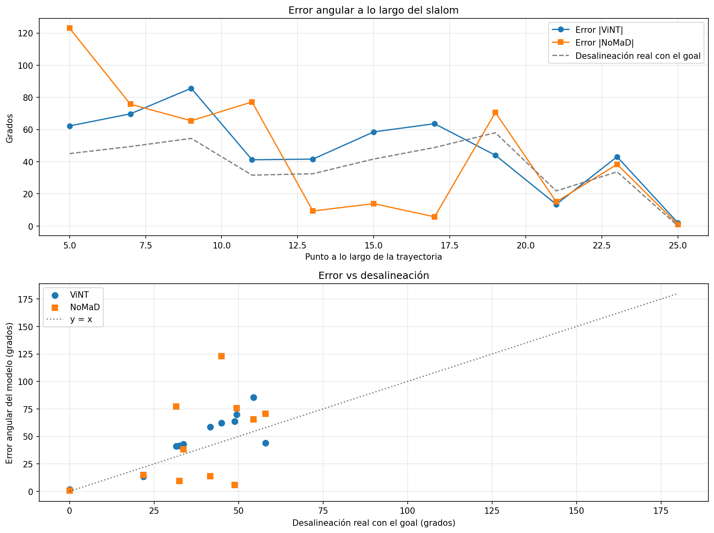
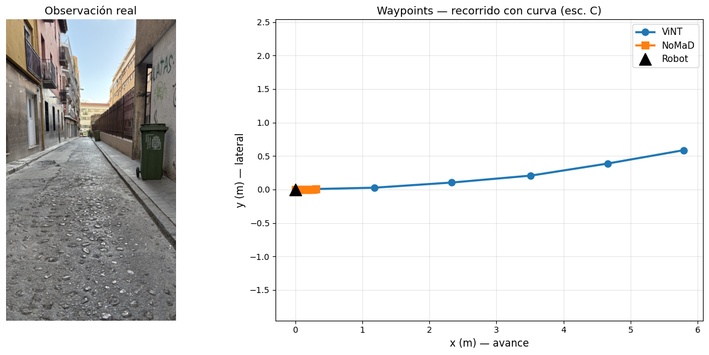
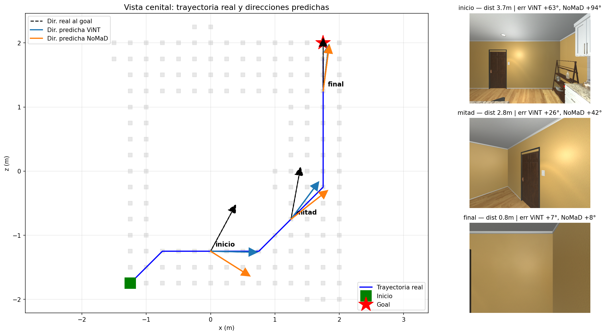
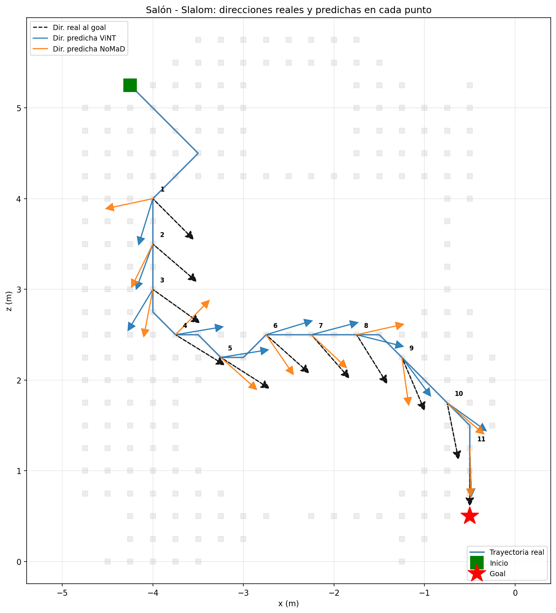

# Vision-Language-Action Models for Autonomous Navigation

Bachelor's thesis (TFG) · ETSIIT, Universidad de Granada

A review of VLA architectures for navigation, plus an empirical comparison of two navigation foundation models from UC Berkeley, **ViNT** (deterministic) and **NoMaD** (diffusion-based). I tested them on real street photos from Granada and in the AI2-THOR simulator, to see how they behave outside their training domain.

> **Scope note:** ViNT and NoMaD have no language component, so they are not VLA models in the strict sense. I used them as runnable representatives of the two action-generation paradigms (deterministic vs. diffusion) at the center of the VLA debate. NaVILA and OmniVLA are covered in the theoretical review only: running them needs a GPU with more than 24 GB of VRAM, which was not available.

## Key takeaways

**1. Prediction quality depends on alignment, not distance.**
In a zigzag path through a living room (11 evaluation points), the angular error tracked how far the agent was turned away from the goal. At the final point, where the agent faced the goal directly, the error dropped to 2° (ViNT) and 1° (NoMaD). The largest errors appeared at far-away points with high misalignment. The correlation between error and misalignment was r = 0.87 for ViNT and r = 0.51 for NoMaD. In practice: both models point the right way when the goal is visible and in front of them, and default to roughly straight-ahead motion when it isn't.

*ViNT's error follows the misalignment closely (r = 0.87); NoMaD's is noisier (r = 0.51).*

**2. A more sophisticated architecture is not automatically better out of domain.**
On phone photos from Granada, far from the training data, NoMaD's diffusion policy gave much more conservative predictions than ViNT. This suggests that diffusion-based navigation may need more data or fine-tuning to generalize.

*The evidence is small-scale (4 real trajectories, one path per simulated environment): treat these as indications, not proofs.*

## What's inside

**1. Review**
- VLMs, autonomous navigation in robotics, and VLA models
- World models in VLA/VLN systems
- NaVILA (legged-robot navigation) and OmniVLA (omni-modal conditioning)
- A short parallel with an industrial system, Tesla FSD

**2. Experiments**

*Real photos (qualitative).* Four trajectories, each made of six consecutive phone photos taken at about 50-100 cm height around Granada, deliberately different from the training data (mostly indoor scenes, fisheye robot cameras):
- inside a house (corridor)
- straight street with vehicles and pedestrians
- straight street
- street with a bend (T4)

From each trajectory, three scenarios are built:
- **A:** the robot has just arrived (predicted distance should be near zero)
- **B:** robot at the start, far from the goal (long trajectory expected)
- **C:** reversed context/goal order (can the model plan a way back?)

*AI2-THOR (quantitative, with ground truth).* A kitchen (FloorPlan1) and a living room (FloorPlan201). At several points along each path the models predict a heading, which is compared with the true direction to the goal. Metric: angular error in degrees.

## Findings on real photos

| Aspect | ViNT | NoMaD |
|---|---|---|
| Distance estimation | Consistent (A vs B/C ratio ~1:13) | Consistent (~1:12) |
| Waypoint magnitude | Wide (up to 6 m) | Compact (27-50 cm) |
| Reaction to a visible curve | High (up to 1.4 m lateral) | Low (a few cm) |
| Backward motion (scenario C) | No (x always positive) | No (x always positive) |
| Prediction variability | None (deterministic) | Very low (sigma < 0.02 m) |
| Inference cost | One forward pass | Denoising loop |

*Trajectory T4 (street with a bend). Left: real photo of the route, showing the curve of the roadway. Right: top-down view of the waypoints predicted by ViNT and NoMaD.*

- **Global vs. local planner.** ViNT outputs a long trajectory in one shot; NoMaD outputs short steps meant to be re-applied in a 4 Hz control loop. A single static call only shows NoMaD's first stretch.
- **No reversing.** Both models predicted forward-only waypoints even when the goal was behind. Since the architectures differ, my hypothesis is that this comes from forward-dominated training data.
- **Why NoMaD is so compact (three non-exclusive hypotheses):** visual domain gap, incremental action representation, and a diffusion policy falling back to a safe prior when the visual encoding is out of domain.

## AI2-THOR validation

**Kitchen (FloorPlan1), diagonal path, 3 points.** The error shrinks as the agent approaches the goal, which confirmed the initial hypothesis. But distance and misalignment decreased together, so this run could not tell which one mattered.

| Point | ViNT | NoMaD |
|---|---|---|
| Start | 63° | 94° |
| Middle | 26° | 42° |
| End | 7° | 8° |

*Kitchen (FloorPlan1). Left: top-down view with the true path (blue), start (green), goal (red star) and, at the three evaluation points, the true direction to the goal (dashed black) versus the directions predicted by ViNT (blue) and NoMaD (orange). Right: first-person views at those points, with each model's angular error.*

**Living room (FloorPlan201), zigzag path, 11 points.** Designed to decouple the two factors: distance falls steadily while the agent's heading oscillates around obstacles. Result: error follows misalignment (see key takeaway 1). NoMaD was more erratic: at some mid-path points (5-7) it was surprisingly accurate, at others it deviated more than ViNT, consistent with its stochastic policy.

*Top-down view of the zigzag path. Where the agent is not facing the goal, the models' arrows (pointing forward) diverge from the true direction.*

## Limitations

- Neither model is a strict VLA (no language input).
- Free Google Colab (limited sessions, disk reset) limited the scale: few trajectories and point-wise evaluation instead of closed-loop navigation.
- The real-photo study is qualitative, with no standard benchmark metrics (Success Rate, Navigation Error, SPL on R2R-CE or the original GNM dataset).
- Phone photos differ deliberately from the training domain, so the results are not directly comparable with in-distribution numbers from the original papers.

## Code

Notebooks and code are not included in this repository for now. The experimental protocol is described above so the study can be replicated.

## Authorship and acknowledgements

Developed as a Bachelor's thesis at ETSIIT, Universidad de Granada, supervised by Javier Medina Quero and Aurora Polo Rodríguez, who also contributed to parts of the authorship and development of the work.

My contribution: designing and running the experiments to study how ViNT and NoMaD behave outside their training domain (the Granada photo protocol and the AI2-THOR validation), plus the theoretical review.

## References

- **ViNT**: Shah et al., [ViNT: A Foundation Model for Visual Navigation](https://arxiv.org/abs/2306.14846) · [project page](https://visualnav-transformer.github.io)
- **NoMaD**: Sridhar et al., [NoMaD: Goal Masked Diffusion Policies for Navigation and Exploration](https://arxiv.org/abs/2310.07896) · [project page](https://general-navigation-models.github.io/nomad/)
- **NaVILA**: Cheng et al., [NaVILA: Legged Robot Vision-Language-Action Model for Navigation](https://arxiv.org/abs/2412.04453) · [project page](https://navila-bot.github.io)
- **OmniVLA**: Hirose et al., [OmniVLA: An Omni-Modal Vision-Language-Action Model for Robot Navigation](https://arxiv.org/abs/2509.19480)
- **AI2-THOR**: Kolve et al., [AI2-THOR: An Interactive 3D Environment for Visual AI](https://arxiv.org/abs/1712.05474) · [project page](http://ai2thor.allenai.org)